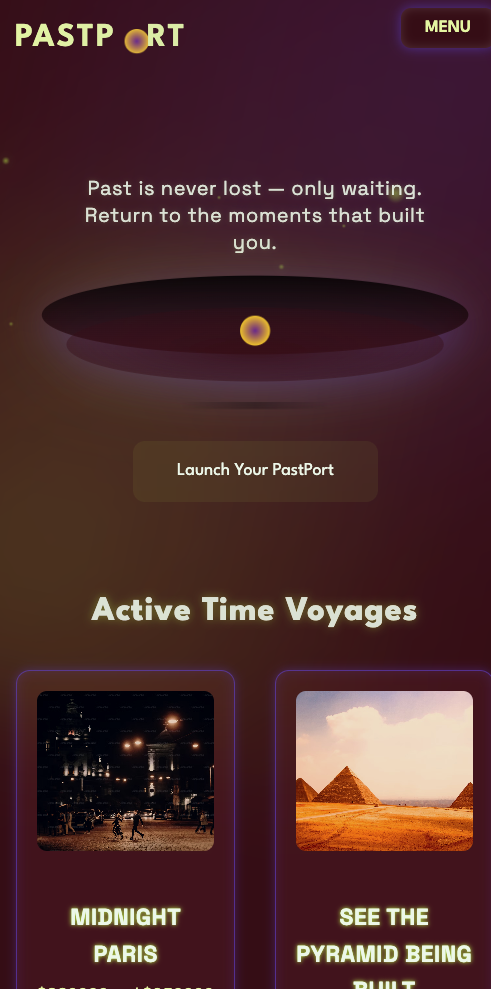
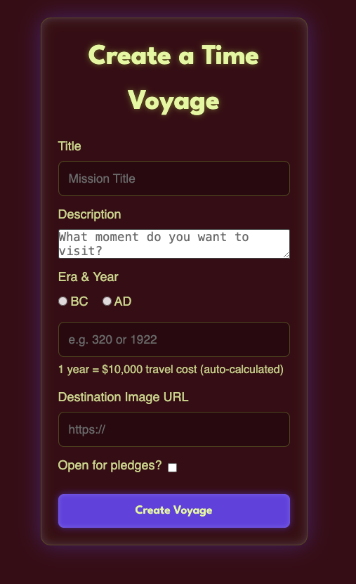
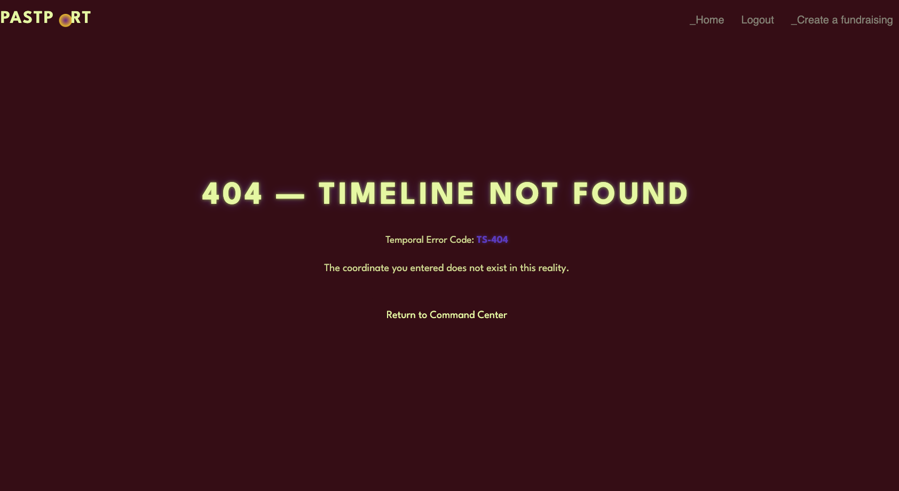

# Crowdfunding Front End
Sara Liang 

## ✨ Link to Deployed Project
gleaming-heliotrope-72b662.netlify.app

## Planning:
### 🕰 The PastPort Project
**What if you can witness the building of the Great Pyrimid with your own eyes?** 
What if you can say good bye to a loved one that you never got a chance to? Or walk in the streets in Paris when it was a movable feast, alongside with Hemingway and Fitzgerald?

Fundraiser Purpose: Users pledge money to gain access to the time machine for a personal trip to the past 

### Intended Audience

- **History Enthusiasts** – who want to witness key moments in history firsthand, from the signing of the Declaration of Independence to the invention of sliced bread.  
- **Regret Fixers** – individuals seeking to right past wrongs, make different choices, or prevent themselves from sending that one embarrassing text.  
- **Investors in Science & Adventure** – people who believe in pushing humanity beyond the limits of physics (and who also enjoy bragging about funding “faster-than-light” travel).  
- **Thrill Seekers** – daredevils eager to experience warp-speed nausea and the risk of minor to severe temporal paradoxes.  
- **Celebrity Time-Tourists** – *"I just want to take a selfie from 1923 and post it on intagram"*

## ✨ Features

- User authentication (Signup / Login / Token)
- Create fundraisers (“Time Voyages”)
- Pledge to fundraisers
- Anonymous pledges
- Edit own fundraisers only
- Custom 404 page (“Timeline Not Found”)
- Unauthorized page (“Temporal Security Protocol TS-403”)
- Responsive UI
- Fully deployed backend + frontend
- only show edit fundraiser button when owner is loggin
- Pledge would update real time on page after user submit a pledge
- Pledges on fundraiser Page would show supporter's name, but show "Mysterious Voyager" if supporter chose to stay anonymous.  

## ✨ Screenshots

### Screenshots of the homepage

### A screenshot of the fundraiser creation page

### A screenshot of a fundraiser with pledges

### 404 pages

